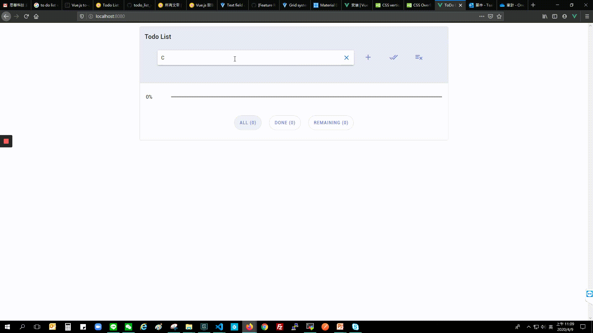
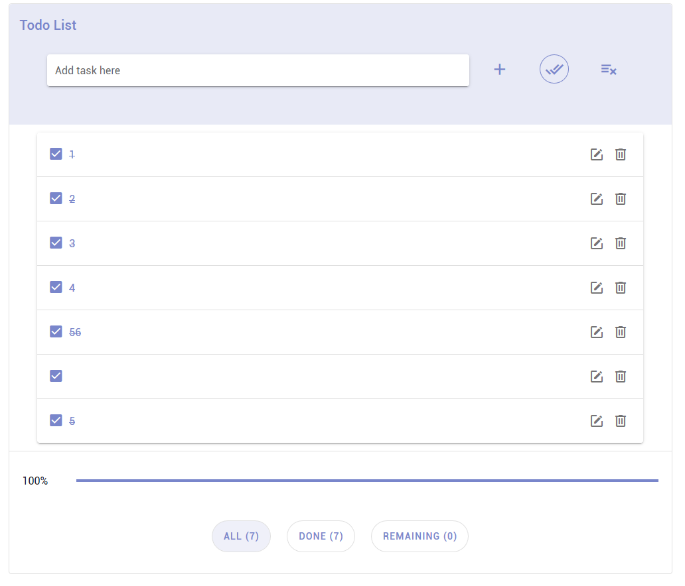
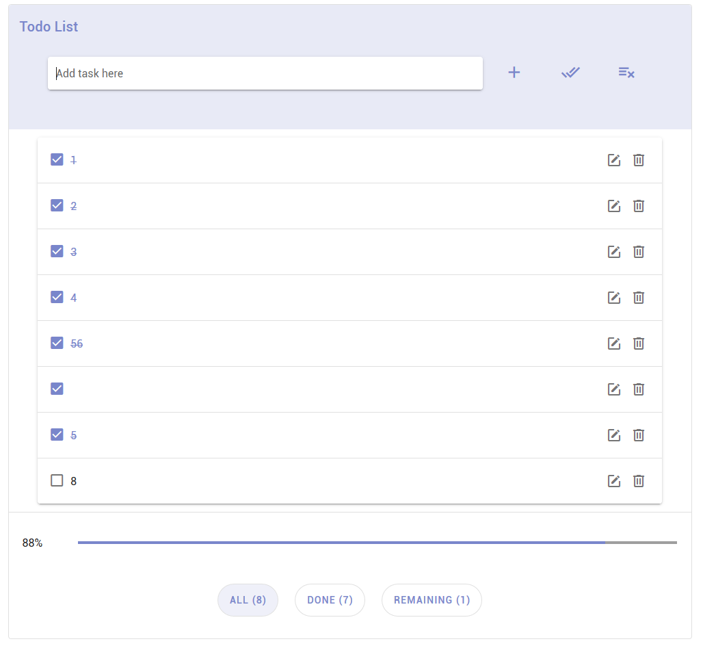

# ToDo List

### How To Use

* Add New
  1. Type in the text field
  2. Click ```Add``` button or press ```Enter```
* View
  * ```ALL``` can show all the tasks
  * ```DONE``` only shows completed/checked tasks
  * ```REMAINING``` shows unchecked/unfinished tasks
* Check all
  - Checked 
  - Unchecked 
* Remove completed/checked tasks
* Progress bar shows percentage of completed tasks

### Project setup
```
npm install
```

### Compiles and hot-reloads for development
```
npm run serve
```

### Compiles and minifies for production
```
npm run build
```

### Lints and fixes files
```
npm run lint
```

### Customize configuration
See [Configuration Reference](https://cli.vuejs.org/config/).
